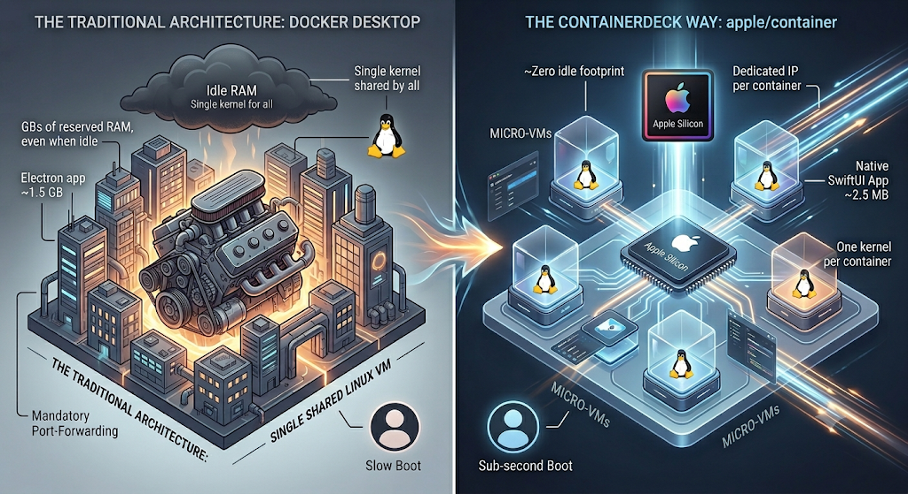

# ContainerDeck

A native macOS GUI for [apple/container](https://github.com/apple/container)
on Apple Silicon: a lightweight Docker Desktop alternative, built with
Swift + SwiftUI — no Electron, no external runtimes.


-black)

## Download

Grab the latest signed-ad-hoc DMG from the
[**Releases**](https://github.com/dmondello/ContainerDeck/releases/latest) page,
or build from source (see below). First launch needs one Gatekeeper step —
see [Installing the DMG](#installing-the-dmg).

## ContainerDeck vs Docker Desktop



The difference is first of all architectural. Docker Desktop runs every
container inside **a single always-on Linux VM** (with GBs of RAM reserved
even when idle). apple/container instead spins up **a dedicated micro-VM per
container** on Apple's Virtualization framework: no idle monolithic VM,
stronger isolation (one kernel per container), a dedicated IP per container
with no mandatory port-forwarding, and sub-second boot optimized for
Apple Silicon.

| | Docker Desktop | ContainerDeck + apple/container |
|---|---|---|
| Architecture | single shared Linux VM | one micro-VM per container |
| Idle footprint | GBs of reserved RAM | ~zero |
| Isolation | shared kernel across containers | one kernel per container |
| Networking | port-forwarding from the VM | dedicated IP per container |
| App size | ~1.5 GB (Electron) | ~4 MB DMG (native SwiftUI) |
| Licensing | paid above company thresholds | open source + free app |
| Account/telemetry | required/present | none |
| Images | OCI (Docker Hub, GHCR…) | OCI (the same images) |

ContainerDeck narrows the classic gap: apple/container has no native compose,
so the app brings its own **Stacks** (a useful docker-compose subset, with
service discovery — see below). Where Docker Desktop is still ahead: the
**full** Compose spec (profiles, multiple networks, build secrets…), built-in
Kubernetes, extensions, and ten years of maturity. apple/container is at 1.0
and requires macOS 15+ on Apple Silicon (macOS 26 for the advanced networking
features). The two tools coexist on the same machine without conflicts:
lightweight local development → ContainerDeck; complex production-parity
orchestration → Docker Desktop.

## Features

Dashboard · containers (create / start / stop / restart / delete, detail with
live stats, env, mounts, raw JSON) · **Stacks** (docker-compose import with
service discovery) · images (pull / delete / create container) · volumes ·
**networks** · **combined multi-container log viewer** (color-coded, filter,
per-container toggle) · per-container live logs · **built-in terminal** (or
hand off to Terminal.app) · English/Italian with live switching · light/dark
theme · Demo mode without a runtime.

## Stacks: docker-compose support

apple/container has no native compose equivalent — ContainerDeck fills the
gap. The **Stacks** section imports a `docker-compose.yml` and orchestrates
it on the runtime:

- **Supported subset**: `services` (image / build context+target+dockerfile /
  command / ports / environment / volumes / depends_on / container_name),
  top-level named `volumes`, `${VAR}` and `${VAR:-default}` interpolation
  from a sibling `.env` file and the process environment.
- **Start order** follows `depends_on` (topological sort); builds run through
  `container build` (BuildKit), named volumes are created on the fly.
- **Ignored with a warning**: `restart` and `healthcheck` (not supported by
  the runtime), system socket mounts like `/var/run/docker.sock` (does not
  exist on apple/container), mount options such as `:ro`.
- **Service discovery is built in**: apple/container 1.0.0 does not resolve
  containers by name (no inter-container DNS, on the default network or a
  custom one — `container system dns create` only covers container→host).
  ContainerDeck closes the gap itself: once every service is running it
  collects their IPs and injects `<ip> <service>` lines into each
  container's `/etc/hosts`. Services are then reachable by their plain name
  (`db`, `http://superset:8088`) exactly as the compose file expects — no
  admin password, works on macOS 15. Because container IDs are global,
  **service names must be unique across stacks running at the same time**.
- Up / Stop / Tear down from the toolbar; tear down keeps named volumes.

## Requirements

- macOS 15 or later (macOS 26 recommended for apple/container networking features)
- Apple Silicon Mac
- [apple/container](https://github.com/apple/container/releases) installed
  (the official `.pkg` from the releases page) — **optional**: without the
  runtime, the app works in *Demo mode*, toggled from Settings
- To build: Swift 6.x (Command Line Tools are enough, Xcode is not required)

## Build and run

```sh
# Run in development
swift run

# Release build + ad-hoc signed .app bundle in dist/
make app

# Direct install
cp -r dist/ContainerDeck.app /Applications/

# Or: disk image for distribution (drag-and-drop to Applications)
make dmg     # → dist/ContainerDeck-<version>.dmg

# Run the test suite
make test
```

## Testing

The test suite is **dependency-free** and runs with the Command Line Tools
alone — no Xcode, no XCTest. It is a self-contained harness
(`Sources/ContainerDeck/Testing/SelfTests.swift`) invoked through the
executable's `--run-tests` flag and exits non-zero on any failure, so it
slots straight into CI:

```sh
make test          # or: swift run ContainerDeck --run-tests
```

It covers the pure logic where regressions hurt most: tolerant JSON access,
the model mappings against the real CLI 1.0.0 schema (container/image/volume/
network/stats), `run` argument generation, and the compose parser
(interpolation, `depends_on` ordering, bare service names, build-context
resolution, skipped-mount warnings).

## Installing the DMG

The DMG is **not notarized by Apple**, so on first launch macOS Gatekeeper
will block the app as coming from an unidentified developer. Allowing it
takes a few seconds:

1. Open the DMG and drag **ContainerDeck** to **Applications**.
2. Launch it once — macOS will refuse to open it. Close the dialog.
3. Go to **System Settings → Privacy & Security**, scroll down and click
   **"Open Anyway"** next to the ContainerDeck message, then confirm.
   (On recent macOS versions the old right-click → Open trick is no longer
   enough.)

This is only needed the first time; afterwards the app opens normally.
Alternatively, you can build it from source yourself (see above) — locally
built apps don't need this step.

## Architecture

```
Sources/ContainerDeck/
├── ContainerDeckApp.swift      SwiftUI entry point
├── Models/                     Domain models (tolerant JSON mapping)
│   ├── DeckContainer.swift     Container + NewContainerSpec (→ container run)
│   ├── DeckImage.swift         Local OCI images
│   ├── DeckVolume.swift        Named volumes
│   ├── DeckNetwork.swift       Container networks
│   ├── ComposeStack.swift      docker-compose parser (Stacks feature)
│   └── EngineTypes.swift       EngineStatus, ContainerStats, formatters
├── Services/
│   ├── ContainerEngine.swift   Protocol + real CLI implementation
│   ├── MockEngine.swift        Demo engine (explore the UI without a runtime)
│   ├── CommandRunner.swift     Async Process (one-shot run + streaming)
│   ├── JSONExtract.swift       Tolerant access to the CLI's JSON
│   ├── Localization.swift      In-app language switching (EN default / IT)
│   └── TerminalLauncher.swift  Opens interactive shells in Terminal.app
├── State/
│   └── AppState.swift          Observable state, polling, actions
├── Testing/
│   └── SelfTests.swift         Dependency-free test suite (--run-tests)
└── Views/
    ├── MainWindow.swift        NavigationSplitView + sidebar + engine status
    ├── DashboardView.swift     Summary cards, error/engine banners
    ├── ContainersListView.swift  Filterable table + quick actions
    ├── StacksView.swift        Compose import + stack orchestration
    ├── ContainerDetailView.swift Overview / Logs / Inspector + shell
    ├── LogViewer.swift         Live streaming, filter, copy
    ├── MultiLogView.swift      Combined logs of many containers, color-coded
    ├── EmbeddedTerminalView.swift  In-app PTY terminal (SwiftTerm)
    ├── NetworksView.swift      List/create/delete container networks
    ├── ImagesView.swift        List + pull + delete images
    ├── VolumesView.swift       List + create + delete volumes
    ├── SettingsView.swift      CLI path, language, theme, polling, demo, diagnostics
    └── Components.swift        StatusBadge, StatCard, menus, banners
```

Principles:

- **Everything goes through the `ContainerEngine` protocol**: the UI never
  talks to the CLI directly. When apple/container ships stable XPC/library
  APIs, a new protocol implementation is all that's needed.
- **Tolerant JSON parsing**: the `--format json` schema is not a stable
  contract across releases; every field is looked up through multiple paths
  and degrades to "—" instead of breaking. The *Inspector* tab always shows
  the raw JSON for debugging.
- **Two external dependencies**: [Yams](https://github.com/jpsim/Yams) for
  YAML parsing (Stacks) and [SwiftTerm](https://github.com/migueldeicaza/SwiftTerm)
  for the built-in terminal — everything else is SwiftUI, Foundation and
  Observation.

## Localization

The UI ships in **English (default) and Italian**, switchable live from
Settings → Interface → Language, with no restart. Strings go through a tiny
`L()`/`LF()` layer (`Services/Localization.swift`); adding a language means
adding one dictionary.

## Known limitations

- Integration is through the `container` **CLI** (`--format json`), not the
  native XPC API yet — see the roadmap. JSON schemas are verified against CLI
  **1.0.0**; future versions may need new fallback paths in the models.
- **Stacks** cover a subset of compose (see above); `restart`, `healthcheck`,
  profiles and per-stack networks are not handled. Service discovery via
  `/etc/hosts` requires service names to be unique across stacks running at
  the same time.
- The CPU percentage is derived from the `cpuUsageUsec` delta between two
  samples: the first refresh after startup shows "—".
- The DMG is not notarized, and there are no automatic updates yet.
- The engine still talks to the CLI, not the native XPC API (next on the
  roadmap).

## Roadmap

Pre-1.0, focused on depth where it differentiates (Stacks, native macOS feel)
rather than chasing full Docker Desktop parity.

### 0.5 — native integration & polish *(in progress)*
- ✅ **Built-in terminal** (SwiftTerm) for `exec`, with Terminal.app as a
  fallback.
- ✅ Re-apply stack `/etc/hosts` wiring automatically when a service restarts.
- Migrate the engine from the CLI to the **`ContainerAPIClient` XPC API**
  behind the existing `ContainerEngine` protocol (faster, no process spawn,
  structured errors). The protocol boundary already makes this a drop-in.
- **Sparkle** auto-updates with an appcast on GitHub Releases.

### 0.6 — deeper Stacks & observability
- Wider compose coverage: `env_file`, multiple `volumes`/bind options,
  per-stack network, `profiles`, a `restart`-like supervise loop.
- Per-service log tab inside the stack view (reusing the multi-log engine).
- **Historical stats** with Swift Charts + a small SQLite store (CPU / memory /
  network over time), beyond the current live snapshot.
- Image **build from Dockerfile** with live progress, and registry search.

### 1.0 — a shippable product
- **Developer ID signing + notarization** and a **Homebrew cask**
  (`brew install --cask containerdeck`) so it installs with no Gatekeeper step.
- Onboarding that detects a missing runtime and offers to install/update it.
- Menu-bar extra with quick actions; full keyboard navigation.

### Later
- Save and switch between multiple named stacks/projects.
- Volume browser (inspect/copy files) and container file explorer.
- Plugin points for custom registries and actions.

## Changelog

See [CHANGELOG.md](CHANGELOG.md) for the full history. Released builds are on
the [Releases](https://github.com/dmondello/ContainerDeck/releases) page.
